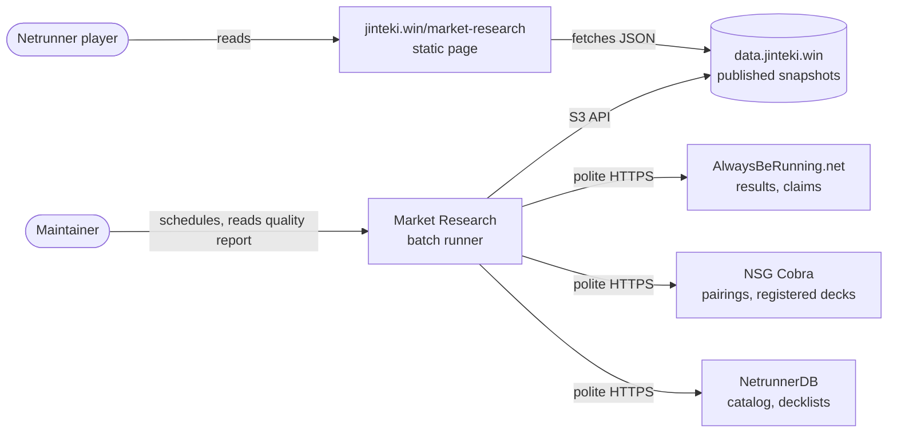
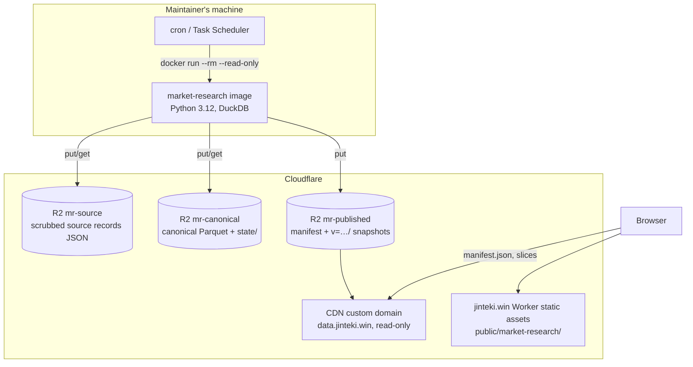
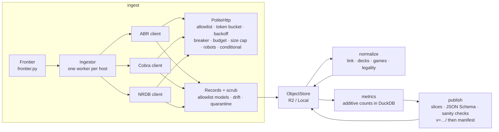
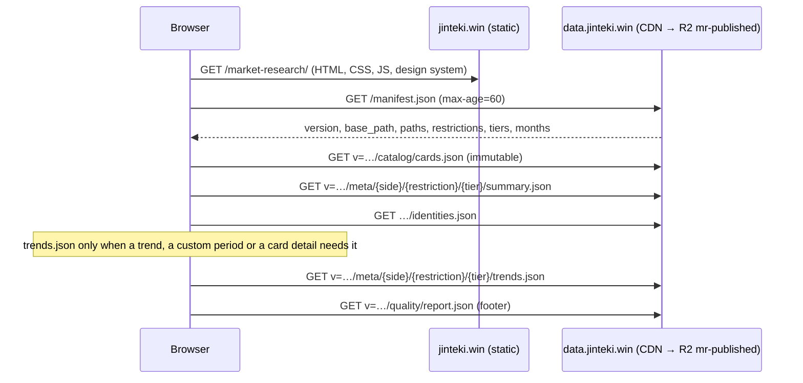

# Market Research: architecture

Market Research collects NSG Netrunner Standard tournament results and decklists, keeps them
without personal data, and publishes precomputed card-meta snapshots for a static page on
jinteki.win. Cloudflare is the only hosting: R2 for storage, the CDN for serving. There is no
Worker on the read path and no database in v1.

## 1. System context

- Sources are read only through their public, anonymous interfaces, at a fixed polite rate, within
  a per-run budget, obeying robots.txt. Nothing authenticates to them.
- Readers never reach the pipeline; they only get static JSON from the CDN.

## 2. Containers

- **Batch runner:** one Docker image with CLI commands. It keeps **no state on local disk** between
  runs: every run loads the frontier and canonical Parquet from R2 into an in-memory DuckDB, merges
  the new data and writes the files back. One maintainer, runs never overlap, so there is no locking.
- **R2 buckets:** `mr-source` (source records, rewritten only when their hash changes),
  `mr-canonical` (tables and `state/`), `mr-published` (served read-only on `data.jinteki.win`).
- **The page** is plain HTML, CSS and one ES module in `public/market-research/`, served with the
  rest of jinteki.win by its existing Worker as static assets (no code runs for these paths).

## 3. Pipeline components

| Module | Responsibility |
|---|---|
| `http.py` | The only HTTP layer: host allowlist (also for redirects), one request in flight per host, jittered interval (ABR 1/2 s, Cobra 1/2 s, NRDB 1/s), `Retry-After`, exponential backoff capped at 5 min, circuit breaker after 5 consecutive failures, per-host budget, 10 s/30 s timeouts, 5 MB cap, robots.txt (cached 24 h), ETag/Last-Modified. Clock and sleep are injected. |
| `sources/` | Build URLs from constants and strictly parsed IDs, parse responses into records. |
| `records.py`, `scrub.py` | Allowlisted record models; drift warnings (names only); quarantine. |
| `frontier.py` | Scheduling: fixed intervals for discovery, decaying intervals with age ceilings (daily < 14 days, weekly < 3 months, monthly < 1 year, then frozen), fetch-once items, change signals, priority by tier and size. |
| `ingest.py` | Discovery (ABR lists, Cobra index, catalogs, NRDB by day), handlers per item kind, rounds across hosts in parallel, periodic flush (every 100 items or 5 minutes, and on any exit). |
| `normalize.py`, `catalog.py` | Canonical tables, Cobra↔ABR linking, deck precedence and comparison, game derivation, Standard and ban-list resolution, legality. |
| `metrics.py` | Additive counts per side, ban list, tier group, month and card; identity counts; baselines. |
| `publish.py` | Every slice, the catalog and the quality report; JSON Schema validation and sanity checks; upload of `v=…/` (immutable) and then `manifest.json` (60 s). |
| `runner.py`, `cli.py` | `run-all`, `backfill` phases and `--plan`, exit codes, run summary. |
| `storage.py` | `ObjectStore` with `R2ObjectStore` and `LocalObjectStore`; nothing else touches storage. |

**A normal run** (`run-all`) makes about 100–250 requests in a few minutes: three ABR list checks at
most, the Cobra index until the first known tournament, conditional catalog checks, NRDB by-day for
yesterday and today, then whatever the frontier says is due, highest priority first, until each
host's budget (400) is spent. If a host trips its breaker the run still normalizes and publishes and
exits with code 2.

**The initial load** (`backfill`) runs without a per-run budget at the same per-host rates: Phase 0
lists (ABR results in pages of 200, the Cobra index, the catalog, every NRDB by-day file in the
window), then Phase 1 (last 3 months, all tiers), Phase 2 (older, Megacity+), Phase 3 (the rest),
publishing after each phase. Items already done are skipped, so an interrupted backfill resumes.
`backfill --plan` makes only the listing requests and prints per-host request counts and durations.

## 4. Serving path

- Slice paths are deterministic, so the page builds them from the manifest alone.
- Version directories are immutable and cached for a year; only the manifest has a short TTL, and it
  is uploaded last, so a reader never sees a half-published version.
- `data.jinteki.win` must send `Access-Control-Allow-Origin: https://jinteki.win` (an R2 CORS rule),
  because the page's origin differs from the data host. See [operations.md](operations.md).
- All arithmetic for custom periods, merged tiers and card details is in `public/market-research/data.js`,
  which is tested with `node --test` against the pipeline's golden snapshot.

## Repository layout note

The brief describes a `site/` tree. This repository serves the site from `public/` (the existing
Worker's static-asset directory), so the page lives in `public/market-research/` and the design
system files in `public/shared/jw/`; the landing page (`public/index.html`) links to it, and the Trace log analyzer
(`public/trace/index.html`) gains only a footer link. CI path filters use those paths.
